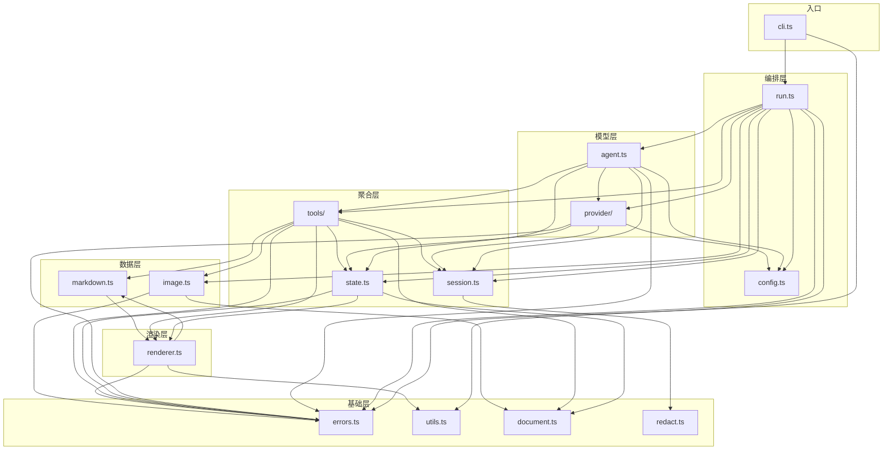
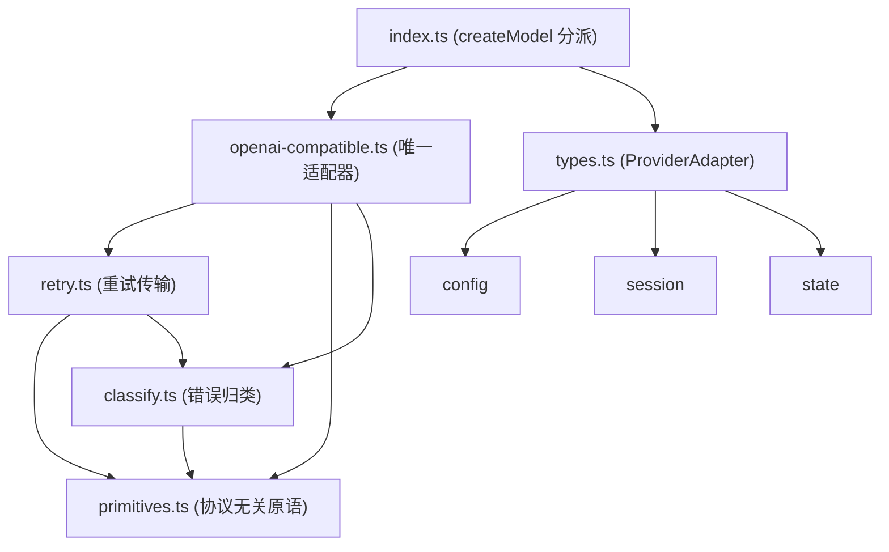
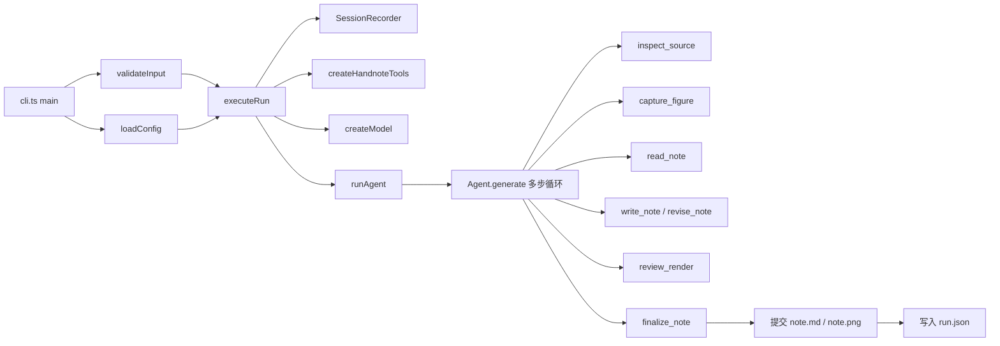

# 架构图

## 模块依赖分层

```mermaid
flowchart TB
    subgraph base["基础层"]
        errors["errors.ts"]
        utils["utils.ts"]
        document["document.ts"]
        redact["redact.ts"]
    end
    subgraph data["数据层"]
        markdown["markdown.ts"]
        image["image.ts"]
    end
    subgraph render["渲染层"]
        renderer["renderer.ts"]
    end
    subgraph aggregate["聚合层"]
        state["state.ts"]
        session["session.ts"]
        tools["tools/"]
    end
    subgraph model["模型层"]
        provider["provider/"]
        agent["agent.ts"]
    end
    subgraph orchestrate["编排层"]
        config["config.ts"]
        run["run.ts"]
    end
    subgraph entry["入口"]
        cli["cli.ts"]
    end

    markdown --> renderer
    image --> document
    image --> errors
    renderer --> markdown
    renderer --> utils
    renderer --> errors
    session --> redact
    tools --> markdown
    tools --> image
    tools --> renderer
    tools --> document
    tools --> state
    tools --> session
    tools --> errors
    state --> document
    state --> renderer
    state --> errors
    provider --> config
    provider --> session
    provider --> state
    provider --> errors
    agent --> provider
    agent --> config
    agent --> session
    agent --> state
    agent --> tools
    agent --> errors
    run --> agent
    run --> config
    run --> image
    run --> provider
    run --> session
    run --> state
    run --> tools
    run --> errors
    run --> utils
    cli --> run
    cli --> errors
```

## provider/ 内部子图

```mermaid
flowchart TB
    index["index.ts (createModel 分派)"]
    types["types.ts (ProviderAdapter)"]
    primitives["primitives.ts (协议无关原语)"]
    retry["retry.ts (重试传输)"]
    classify["classify.ts (错误归类)"]
    adapter["openai-compatible.ts (唯一适配器)"]

    index --> adapter
    index --> types
    adapter --> retry
    adapter --> primitives
    adapter --> classify
    retry --> primitives
    retry --> classify
    classify --> primitives
    types --> config
    types --> session
    types --> state
```

依赖方向严格自上而下: `index` 只依赖适配器与类型, 传输层 `retry` 与归类层 `classify` 只依赖协议无关的 `primitives`, 适配器依赖传输层并注入线格式修复钩子, 无环.

## 端到端数据流

```mermaid
flowchart LR
    cli["cli.ts main"] --> validate["validateInput"]
    cli --> config["loadConfig"]
    validate --> execute["executeRun"]
    config --> execute
    execute --> recorder["SessionRecorder"]
    execute --> tools["createHandnoteTools"]
    execute --> model["createModel"]
    execute --> agent["runAgent"]
    agent --> generate["Agent.generate 多步循环"]
    generate --> inspect["inspect_source"]
    generate --> capture["capture_figure"]
    generate --> read["read_note"]
    generate --> write["write_note / revise_note"]
    generate --> review["review_render"]
    generate --> finalize["finalize_note"]
    finalize --> commit["提交 note.md / note.png"]
    commit --> manifest["写入 run.json"]
```